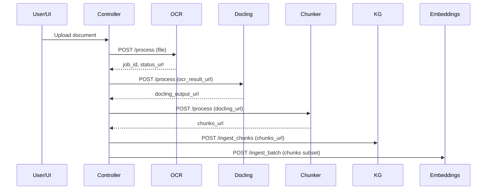
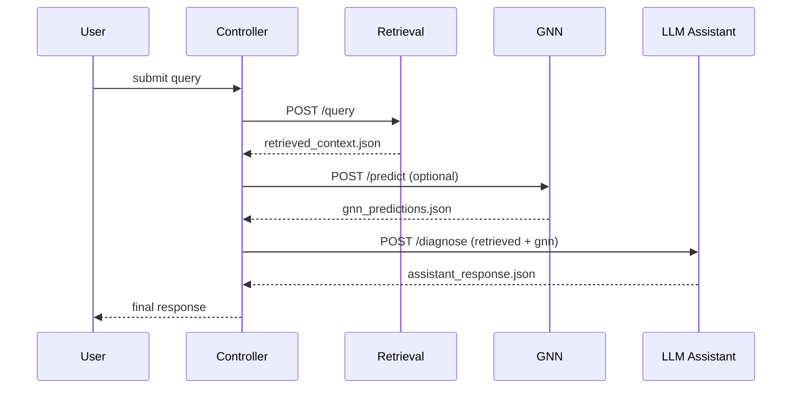

# Diagrams (Mermaid)

## End-to-end pipeline
```mermaid
flowchart TD
    A[Document Input: PDF / DOCX / PPTX / Images] --> B[Phase 1: OCR Service]
    B --> C[Phase 2: Docling Structure Extraction]
    C --> D[Phase 3: Chunker]
    D --> E[Phase 4: KG Builder]
    D --> F[Phase 5: Embeddings & Vector Store]
    E --> G[Phase 6: Hybrid Retrieval Engine]
    F --> G
    G --> H[Phase 7: GNN Reasoning (optional)]
    H --> I[Phase 8: LLM Diagnostic Assistant]
    I --> J[Final Diagnostic Report]
```

## Ingestion Sequence (detailed)


## Retrieval Sequence


## Deployment Topology
```mermaid
flowchart LR
    subgraph Azure_VM[Azure VM (Prod)]
        subgraph Docker[Docker Network]
            CTRL[Controller]
            UI[Controller UI]
            P1[OCR Service]
            P2[Docling Service]
            P3[Chunker Service]
            P4[KG Builder]
            P5[Embed Service]
            P6[Retrieval Service]
            P7[GNN Service]
            P8[LLM Assistant Service]
        end
    end
    Blob[Azure Blob Storage]
    Neo4j[Neo4j Graph DB]
    Vector[Milvus / Qdrant]
    LLMAPI[Azure OpenAI / Foundry]
    CTRL -- Blob
    P4 -- Neo4j
    P5 -- Vector
    CTRL -- LLMAPI
```

